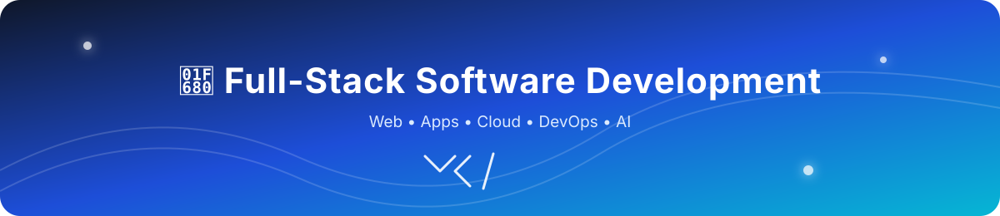

<p align="center"></p>

## 💻 Full-Stack Software Development

### Web Development • App Development • Cloud • DevOps • AI

### 🆓 100% Free Learning Resources

> A practical, beginner-to-advanced roadmap combining modern **Full-Stack Web, App & Cloud Development** with free learning resources.

---


## 🗺️ Roadmap at a Glance

This curriculum is organized into **18 months**, progressing from web/software foundations to modern frontend development, backend engineering, databases, cloud, DevOps, AI-assisted development, mobile development, a production-style capstone, and career preparation.

 > **Suggested pace:** 2–3 hours/day, 6 days/week. Each month combines learning, hands-on practice, revision, and at least one project.

### 📊 18-Month Overview

| Month | Focus | Modules | Main Outcome |
|---|---|---|---|
| **01** | Software + Web Foundations | 1–2 | Software engineering, Internet, HTTP, browsers, APIs |
| **02** | HTML + CSS | 3–4 | Semantic, responsive websites |
| **03** | UI/UX + Accessibility | 5–6 | Accessible, responsive interfaces |
| **04** | JavaScript Fundamentals | 7 | Interactive browser applications |
| **05** | Advanced JavaScript | 8 | Modern JS, async programming, APIs |
| **06** | TypeScript + Git/GitHub | 9–10 | Typed development + professional Git |
| **07** | React | 11 | Component-based SPAs |
| **08** | Modern Frontend + Animation | 12–13 | Production-style React UI + animation |
| **09** | Next.js | 14 | Modern full-stack React applications |
| **10** | Node.js + Express | 15–16 | Backend services + REST APIs |
| **11** | Security + Databases | 17–18 | Secure apps + MongoDB/PostgreSQL |
| **12** | Python + Flask + Django | 19–21 | Python backend/full-stack development |
| **13** | APIs + Cloud | 22–23 | API architecture + cloud fundamentals |
| **14** | Docker + Kubernetes | 24–26 | Containers + orchestration |
| **15** | Microservices + Serverless + DevOps | 27–29 | Distributed systems + CI/CD |
| **16** | Testing + Infrastructure + Payments | 30–33 | Testing, real-time systems, payments, Supabase |
| **17** | Mobile + AI + Linux + Deployment | 34–37 | Mobile, AI workflows, Linux, deployment |
| **18** | Projects + Capstone + Career | 38–40 | Production project + portfolio + career |

---

# 📅 MONTH 01 — Software & Web Foundations

### Modules
- **Module 1 — Software Engineering Foundations**
- **Module 2 — Internet & Web Fundamentals**

### Learn
- SDLC, Agile, software architecture and design patterns
- Development environments and IDEs
- Frontend vs backend vs full stack
- Cloud-native concepts and deployment
- Basic programming concepts
- Internet, client/server architecture and HTTP/HTTPS
- DNS, IP addresses, URLs and domains
- Browsers, rendering, APIs, cookies, sessions and CDNs

### 🛠️ Projects
- Developer environment setup
- HTTP/API exploration
- Software-engineering notes

### ✅ Month Goal
Understand **how software and the Web work before writing serious frontend code**.

---

# 📅 MONTH 02 — HTML5 + CSS3

### Modules
- **Module 3 — HTML5**
- **Module 4 — CSS3 & Responsive Web Design**

### Learn
- Semantic HTML, forms, validation and multimedia
- SEO and accessibility basics
- CSS selectors, cascade, specificity and box model
- Typography, Flexbox and CSS Grid
- Responsive/mobile-first design
- Media queries, variables, transitions and animations

### 🛠️ Projects
- Personal landing page
- Responsive portfolio page
- Login/register interface
- Product landing page

### ✅ Month Goal
Build **responsive websites from scratch without relying on frameworks**.

---

# 📅 MONTH 03 — UI/UX + Accessibility

### Modules
- **Module 5 — UI Design & Frontend Tools**
- **Module 6 — Accessibility & Web Standards**

### Learn
- Figma, wireframes, layouts and components
- Auto Layout and design systems
- Developer Mode and pixel-perfect implementation
- Bootstrap, Tailwind CSS, SVG and icon systems
- WCAG, ARIA, keyboard navigation and screen readers
- Accessible forms, focus management and color contrast

### 🛠️ Projects
- Figma → HTML/CSS implementation
- Bootstrap landing page
- Tailwind dashboard
- Accessible website

### ✅ Month Goal
Turn a **design into a responsive, accessible frontend**.

---

# 📅 MONTH 04 — JavaScript Fundamentals

### Module
- **Module 7 — JavaScript Fundamentals**

### Learn
- Variables, data types and operators
- Strings, arrays and objects
- Functions and scope
- Conditions and loops
- Events and DOM manipulation
- Forms and validation
- Browser APIs
- LocalStorage and JSON
- Error handling and debugging

### 🛠️ Projects
- Calculator
- Todo App
- Quiz App
- Expense Tracker

### ✅ Month Goal
Build **interactive browser applications using vanilla JavaScript**.

---

# 📅 MONTH 05 — Advanced JavaScript / ES6+

### Module
- **Module 8 — Advanced JavaScript / ES6+**

### Learn
- Arrow functions and template literals
- Destructuring and spread/rest
- Array methods, Map and Set
- Higher-order functions and callbacks
- Promises and Async/Await
- Fetch API and modules
- Classes and closures
- Event loop
- Optional chaining and nullish coalescing
- AJAX and REST API consumption

### 🛠️ Projects
- Weather App
- GitHub User Search
- Movie Search App
- REST API Dashboard

### ✅ Month Goal
Become comfortable with **modern asynchronous JavaScript and APIs**.

---

# 📅 MONTH 06 — TypeScript + Git/GitHub

### Modules
- **Module 9 — TypeScript**
- **Module 10 — Git & GitHub**

### Learn
**TypeScript**
- Type annotations and inference
- Interfaces and type aliases
- Generics
- Union/intersection types
- Type guards and utility types
- Modules
- tsconfig.json
- TypeScript with React and Node.js

**Git/GitHub**
- Repositories, staging and commits
- Branches, merge, rebase and cherry-pick
- Pull Requests and code review
- Issues and forks
- Open-source contribution
- GitHub CLI and GitHub Desktop

### 🛠️ Projects
- Convert a JavaScript project to TypeScript
- Create a professional GitHub repository
- Make an open-source contribution

### ✅ Month Goal
Write **maintainable typed code and use Git/GitHub professionally**.

---

# 📅 MONTH 07 — React

### Module
- **Module 11 — React**

### Learn
- React, JSX and components
- Props and state
- Events and conditional rendering
- Lists and forms
- Hooks: useState, useEffect and useContext
- Custom hooks
- Component architecture
- React Router
- API integration

### 🛠️ Projects
- React Todo App
- Weather App
- Blog UI
- Course platform
- Admin dashboard

### ✅ Month Goal
Build **component-based React applications with routing, state and APIs**.

---

# 📅 MONTH 08 — Modern Frontend + Animation

### Modules
- **Module 12 — Modern Frontend Tooling**
- **Module 13 — GSAP, Framer Motion & Web Animation**

### Learn
- Node.js/npm, Vite, ESLint and Prettier
- Environment variables and Axios
- Context API, Redux Toolkit, TanStack Query and Zustand
- Tailwind CSS and shadcn/ui
- CSS animations
- Framer Motion / Motion
- GSAP, timelines and ScrollTrigger
- Layout/gesture animations and page transitions
- SVG animation and performance
- Reduced-motion accessibility

### 🛠️ Projects
- Animated React landing page
- Framer Motion portfolio
- GSAP ScrollTrigger portfolio
- Animated dashboard
- GSAP + Motion portfolio

### ✅ Month Goal
Build **polished, production-style React interfaces**.

---

# 📅 MONTH 09 — Next.js

### Module
- **Module 14 — Next.js**

### Learn
- Next.js and App Router
- Routing and layouts
- Server and Client Components
- Data fetching and dynamic routes
- API routes
- Metadata and image optimization
- Authentication
- Deployment
- Full-stack Next.js

### 🛠️ Projects
- Next.js portfolio
- Blog
- Dashboard
- Authentication application

### ✅ Month Goal
Build **modern full-stack React applications with Next.js**.

---

# 📅 MONTH 10 — Node.js + Express

### Modules
- **Module 15 — Node.js**
- **Module 16 — Express.js & Backend APIs**

### Learn
- Node.js runtime, npm and modules
- File system, events and streams
- HTTP and asynchronous programming
- Express routing and middleware
- Controllers and services
- MVC
- REST APIs and CRUD
- HTTP methods and status codes
- API validation
- Postman and API documentation

### 🛠️ Projects
- REST API
- Todo API
- Blog API
- Authentication API

### ✅ Month Goal
Build **real backend services and REST APIs**.

---

# 📅 MONTH 11 — Security + Databases

### Modules
- **Module 17 — Authentication & Web Security**
- **Module 18 — Databases**

### Learn
**Security**
- Authentication vs authorization
- Sessions and cookies
- JWT and password hashing/Bcrypt
- CORS and HTTPS
- CSP, XSS, CSRF and SQL Injection
- OWASP, API security and environment secrets

**Databases**
- MongoDB documents, collections, CRUD, queries and indexes
- Aggregation and MongoDB with Node.js
- PostgreSQL, SQL and relationships
- JOINs, aggregation, indexes and transactions

### 🛠️ Projects
- Full-stack authentication system
- MongoDB CRUD application
- PostgreSQL CRUD application

### ✅ Month Goal
Build **secure full-stack applications backed by real databases**.

---

# 📅 MONTH 12 — Python + Flask + Django

### Modules
- **Module 19 — Python**
- **Module 20 — Flask**
- **Module 21 — Django & SQL Databases**

### Learn
- Python fundamentals, OOP, modules and packages
- File handling, APIs and JSON
- NumPy, Pandas and Jupyter
- Flask routes, REST APIs, CRUD and testing
- Django projects, apps, URLs, views and templates
- Models, ORM and migrations
- Authentication, forms and admin
- SQL databases and deployment

### 🛠️ Projects
- Flask REST API
- Django Blog
- Django Authentication System

### ✅ Month Goal
Build **Python-based backend and full-stack applications**.

---

# 📅 MONTH 13 — API Architecture + Cloud

### Modules
- **Module 22 — Full-Stack API Architecture**
- **Module 23 — Cloud Computing**

### Learn
- Frontend ↔ backend architecture
- REST, CRUD, controllers, services and models
- Authentication and authorization
- Validation and error handling
- API versioning and Swagger/OpenAPI
- IaaS, PaaS and SaaS
- Public/private/hybrid cloud
- Multicloud
- Cloud-native applications
- Containers, serverless and microservices

### 🛠️ Projects
- Production-style REST API
- OpenAPI documentation
- Cloud-deployed full-stack application

### ✅ Month Goal
Understand **how modern full-stack applications are architected and hosted**.

---

# 📅 MONTH 14 — Docker + Kubernetes

### Modules
- **Module 24 — Docker & Containers**
- **Module 25 — Kubernetes**
- **Module 26 — OpenShift & Istio**

### Learn
- Docker images, containers and Dockerfiles
- Docker CLI and Compose
- Volumes, networks and registries
- Kubernetes clusters, nodes and Pods
- Services, Deployments and ReplicaSets
- ConfigMaps, Secrets and YAML
- Scaling and rolling updates
- OpenShift and Operators
- Routes and service mesh
- Istio, traffic management and observability

### 🛠️ Projects
- Dockerize a full-stack app
- Multi-container application
- Kubernetes deployment
- Basic service-mesh experiment

### ✅ Month Goal
Understand **containerization and orchestration**.

---

# 📅 MONTH 15 — Microservices + Serverless + DevOps

### Modules
- **Module 27 — Microservices**
- **Module 28 — Serverless**
- **Module 29 — DevOps & CI/CD**

### Learn
- Monolith vs microservices
- Service boundaries and API Gateway
- Service discovery and communication
- Scalability and fault tolerance
- Distributed systems
- Serverless functions
- Event-driven applications
- Cloud Functions
- CI/CD and GitHub Actions
- Automated testing
- Build/deployment pipelines
- Secrets and monitoring

### 🛠️ Projects
- Microservices demo
- Serverless API
- GitHub Actions CI/CD pipeline

### ✅ Month Goal
Understand **modern deployment, automation and distributed application architecture**.

---

# 📅 MONTH 16 — Testing + Infrastructure + Payments + Supabase

### Modules
- **Module 30 — Testing**
- **Module 31 — Backend Services & Infrastructure**
- **Module 32 — Payments**
- **Module 33 — Supabase**

### Learn
- Unit, integration and E2E testing
- Vitest, Playwright and Testing Library
- WebSockets and Socket.IO
- Redis, caching and message queues
- File uploads and Cloudinary
- Background jobs
- Payment APIs, checkout and webhooks
- Refunds and transaction verification
- Supabase Auth
- PostgreSQL, Storage and Row Level Security

### 🛠️ Projects
- Real-time chat application
- Payment-enabled application
- Supabase SaaS application

### ✅ Month Goal
Add **testing, real-time communication, storage, payments and scalable backend services**.

---

# 📅 MONTH 17 — Mobile + AI + Linux + Deployment

### Modules
- **Module 34 — Mobile App Development**
- **Module 35 — AI-Assisted Software Development**
- **Module 36 — Linux & CLI**
- **Module 37 — Deployment & Hosting**

### Learn
**Mobile**
- React Native and Expo
- Navigation and state
- APIs, authentication and storage
- Android/iOS builds

**AI**
- Generative AI
- AI coding assistants
- Prompt engineering
- AI debugging and refactoring
- AI agents and agentic workflows
- LLM APIs
- Responsible AI
- AI-powered applications

**Linux**
- Terminal and filesystem
- Permissions and processes
- Bash and SSH
- Package managers
- Server basics

**Deployment**
- Vercel, Netlify and GitHub Pages
- Cloudflare Pages
- Domains, DNS and SSL
- Environment variables
- CI/CD deployment

### 🛠️ Projects
- React Native application
- AI-powered web application
- Linux/CLI deployment workflow
- Production deployment

### ✅ Month Goal
Become comfortable **building, deploying and maintaining applications across web, mobile and AI workflows**.

---

# 📅 MONTH 18 — Projects + Capstone + Career

### Modules
- **Module 38 — Projects**
- **Module 39 — Full-Stack Cloud Capstone**
- **Module 40 — GitHub Portfolio & Career**

### 🎯 Capstone

Build **one serious production-style full-stack application**.

### Recommended Stack

Frontend → React + TypeScript + Tailwind CSS + GSAP/Motion + React Router

Backend → Node.js + Express.js + REST API + JWT

Database → PostgreSQL + MongoDB

Infrastructure → Docker + Kubernetes + CI/CD + Cloud Deployment

AI → LLM API + AI Features + AI-Assisted Development

### Capstone Requirements
- Authentication
- Authorization
- CRUD
- Responsive UI
- REST API
- Database
- File uploads
- Search
- Filtering
- Pagination
- Validation
- Error handling
- Security
- Testing
- Docker
- CI/CD
- Deployment
- Documentation
- AI feature

### 💼 Career
- Professional GitHub README
- Pinned repositories
- Project screenshots
- Live demos
- Personal portfolio
- Resume
- LinkedIn
- Freelancing profiles
- Internship applications
- Junior developer applications
- Technical and behavioral interview preparation
- System/design fundamentals

### ✅ Month Goal
**Ship → document → deploy → showcase → apply.**

---

## 📚 How to Study Each Month

| Week | Focus |
|---|---|
| **Week 1** | Learn fundamentals + take notes |
| **Week 2** | Deep practice + coding exercises |
| **Week 3** | Build a project |
| **Week 4** | Finish project + deploy + revise + document |

### ⏱️ Daily Formula

```text
📚 Learn        → 45–60 min
💻 Code         → 60–90 min
🛠️ Project      → 45–60 min
📝 Notes/Review → 15–20 min
```

> **Rule:** Don't move to the next month just because the calendar says so. Move forward when you can build something with the current month's skills without blindly following a tutorial.

---

# 📚 MODULE 1 — Software Engineering Foundations

### Topics

* What is software engineering?
* Software development lifecycle
* SDLC models
* Agile methodology
* Software architecture
* Software design patterns
* Development environments
* IDEs and code editors
* Frontend vs backend vs full stack
* Software developer roles
* Cloud-native development
* Application deployment
* Basic Python programming
* Variables
* Data types
* Operators
* Conditions
* Loops
* Functions

### 🆓 Free Resources

* [freeCodeCamp — Full Stack Curriculum](https://www.freecodecamp.org/learn/)
* [Python Official Tutorial](https://docs.python.org/3/tutorial/)
* [MDN — Learn Web Development](https://developer.mozilla.org/en-US/docs/Learn_web_development)

---

# 🌐 MODULE 2 — Internet & Web Fundamentals

### Topics

* How the Internet works
* Client and server
* HTTP / HTTPS
* Request and response
* URLs
* Domain names
* DNS
* IP addresses
* Web hosting
* Browsers
* Browser rendering
* Web servers
* APIs
* Cookies
* Sessions
* CDNs
* Frontend/backend communication

### 🆓 Free Resources

* [MDN — How the Web Works](https://developer.mozilla.org/en-US/docs/Learn_web_development/Getting_started/Web_standards/How_the_web_works)
* [MDN — HTTP](https://developer.mozilla.org/en-US/docs/Web/HTTP)
* [Cloudflare — Learning Center](https://www.cloudflare.com/learning/)
* [freeCodeCamp — Internet/Web Development](https://www.freecodecamp.org/learn/)

---

# 🏗️ MODULE 3 — HTML5

### Topics

* HTML document structure
* Semantic HTML
* Headings
* Paragraphs
* Links
* Images
* Audio
* Video
* Lists
* Tables
* Forms
* Input types
* Form validation
* Buttons
* Attributes
* HTML entities
* Metadata
* SEO basics
* Accessibility
* Semantic elements
* HTML5 APIs

### 🆓 Free Resources

* [MDN — HTML](https://developer.mozilla.org/en-US/docs/Web/HTML)
* [MDN — Structuring Content with HTML](https://developer.mozilla.org/en-US/docs/Learn_web_development/Core/Structuring_content)
* [freeCodeCamp — Responsive Web Design](https://www.freecodecamp.org/learn/2022/responsive-web-design/)

> **Replacement:** Any paid HTML/CSS textbook or course → MDN + freeCodeCamp.

---

# 🎨 MODULE 4 — CSS3 & Responsive Web Design

### Topics

* CSS syntax
* Selectors
* Specificity
* Cascade
* Inheritance
* Colors
* Units
* Typography
* Fonts
* Box model
* Margin
* Padding
* Border
* Display
* Positioning
* Flexbox
* CSS Grid
* Responsive design
* Media queries
* Mobile-first design
* Transitions
* Transformations
* Animations
* Variables
* Pseudo-classes
* Pseudo-elements

### 🆓 Free Resources

* [MDN — CSS](https://developer.mozilla.org/en-US/docs/Web/CSS)
* [MDN — CSS Layout](https://developer.mozilla.org/en-US/docs/Learn_web_development/Core/CSS_layout)
* [freeCodeCamp — Responsive Web Design](https://www.freecodecamp.org/learn/2022/responsive-web-design/)
* [CSS-Tricks — Guides](https://css-tricks.com/guides/)

---

# 🖥️ MODULE 5 — UI Design & Frontend Tools

### Topics

* Figma fundamentals
* Wireframes
* UI layouts
* Components
* Auto Layout
* Responsive UI
* Design systems
* Pixel-perfect implementation
* Developer Mode
* Google Fonts
* Font Awesome
* SVG
* Bootstrap
* Tailwind CSS

### 🆓 Free Resources

* [Figma Learn](https://help.figma.com/hc/en-us)
* [Bootstrap Documentation](https://getbootstrap.com/docs/)
* [Tailwind CSS Documentation](https://tailwindcss.com/docs)
* [Google Fonts](https://fonts.google.com/)
* [Font Awesome Documentation](https://docs.fontawesome.com/)

---

# ♿ MODULE 6 — Accessibility & Web Standards

### Topics

* WCAG fundamentals
* Semantic HTML
* ARIA
* Keyboard navigation
* Screen readers
* Color contrast
* Accessible forms
* Focus management
* Accessible navigation
* Web standards

### 🆓 Free Resources

* [MDN — Accessibility](https://developer.mozilla.org/en-US/docs/Web/Accessibility)
* [W3C — Web Accessibility Initiative](https://www.w3.org/WAI/)
* [WebAIM](https://webaim.org/)

---

# ⚡ MODULE 7 — JavaScript Fundamentals

### Topics

* Variables
* Data types
* Operators
* Strings
* Arrays
* Objects
* Functions
* Scope
* Conditions
* Loops
* Events
* DOM
* DOM manipulation
* Forms
* Validation
* Error handling
* Browser APIs
* Local Storage
* JSON
* Debugging

### 🆓 Free Resources

* [MDN — JavaScript](https://developer.mozilla.org/en-US/docs/Web/JavaScript)
* [MDN — JavaScript Guide](https://developer.mozilla.org/en-US/docs/Web/JavaScript/Guide)
* [freeCodeCamp — JavaScript Algorithms and Data Structures](https://www.freecodecamp.org/learn/javascript-algorithms-and-data-structures-v8/)
* [javascript.info](https://javascript.info/)

---

# 🔥 MODULE 8 — Advanced JavaScript / ES6+

### Topics

* `let` / `const`
* Template literals
* Arrow functions
* Destructuring
* Default parameters
* Rest parameters
* Spread syntax
* Enhanced object literals
* Iterators
* `for...of`
* Generators
* Modules
* Map
* Set
* Array methods
* Higher-order functions
* Callbacks
* Promises
* Async / Await
* Fetch API
* Classes
* Ternary operator
* Optional chaining
* Nullish coalescing
* Closures
* Scope
* Event loop
* AJAX
* REST API consumption

### 🆓 Free Resources

* [MDN — JavaScript Guide](https://developer.mozilla.org/en-US/docs/Web/JavaScript/Guide)
* [MDN — Promises](https://developer.mozilla.org/en-US/docs/Web/JavaScript/Reference/Global_Objects/Promise)
* [MDN — Fetch API](https://developer.mozilla.org/en-US/docs/Web/API/Fetch_API)
* [javascript.info](https://javascript.info/)
* [freeCodeCamp — JavaScript](https://www.freecodecamp.org/learn/javascript-algorithms-and-data-structures-v8/)

---

# 🟦 MODULE 9 — TypeScript

### Topics

* TypeScript setup
* Compiler
* Type annotations
* Type inference
* Interfaces
* Type aliases
* Classes
* Generics
* Enums
* Union types
* Intersection types
* Type guards
* Functions
* Modules
* Utility types
* Decorators
* `tsconfig.json`
* TypeScript with React
* TypeScript with Node.js

### 🆓 Free Resources

* [TypeScript Handbook](https://www.typescriptlang.org/docs/handbook/)
* [TypeScript — Getting Started](https://www.typescriptlang.org/docs/)
* [TypeScript Playground](https://www.typescriptlang.org/play)

The official TypeScript Handbook is free and covers the language fundamentals, everyday types, narrowing, functions, objects, classes, modules, and more.

---

# 🐙 MODULE 10 — Git & GitHub

### Topics

* Git fundamentals
* Git installation
* Repository
* Working tree
* Staging
* Commits
* Branches
* Merge
* Rebase
* Cherry-pick
* Remote repositories
* GitHub
* Pull Requests
* Code review
* Issues
* Forks
* Open-source contribution
* GitHub portfolio
* GitHub CLI
* GitHub Desktop

### 🆓 Free Resources

* [Git Official Book](https://git-scm.com/book/en/v2)
* [Git Documentation](https://git-scm.com/doc)
* [GitHub Skills](https://skills.github.com/)
* [GitHub Docs](https://docs.github.com/)
* [freeCodeCamp — Git & GitHub](https://www.freecodecamp.org/news/learn-the-basics-of-git-in-under-10-minutes/)

---

# ⚛️ MODULE 11 — React

### Topics

* React fundamentals
* JSX
* Components
* Props
* State
* Events
* Conditional rendering
* Lists
* Forms
* Hooks
* `useState`
* `useEffect`
* `useContext`
* Custom hooks
* Component architecture
* Reusable components
* API integration
* React Router

### 🆓 Free Resources

* [React Official Learn](https://react.dev/learn)
* [React Documentation](https://react.dev/)
* [freeCodeCamp — Front End Development Libraries](https://www.freecodecamp.org/learn/front-end-development-libraries/)

React's official documentation provides a free interactive learning path covering components, JSX, events, state, hooks and other core concepts.

> **Important:** Create React App is deprecated. For new projects, learn modern React with a current recommended framework or Vite-based setup.

---

# 🧩 MODULE 12 — Modern Frontend Tooling

### Topics

* Node.js
* npm
* Yarn
* package.json
* npm scripts
* Vite
* ESLint
* Prettier
* Module bundling
* Environment variables
* Axios
* Context API
* Redux
* Redux Toolkit
* TanStack Query
* Zustand
* Tailwind CSS
* shadcn/ui

### 🆓 Free Resources

* [Node.js Documentation](https://nodejs.org/docs/latest/api/)
* [npm Documentation](https://docs.npmjs.com/)
* [Vite Documentation](https://vite.dev/guide/)
* [Redux Toolkit](https://redux-toolkit.js.org/)
* [TanStack Query](https://tanstack.com/query/latest)
* [Zustand](https://zustand.docs.pmnd.rs/)
* [Tailwind CSS](https://tailwindcss.com/docs)
* [shadcn/ui](https://ui.shadcn.com/docs)

---

# 🎬 MODULE 13 — GSAP, Framer Motion & Web Animation

### Topics

## GSAP

* GSAP fundamentals
* Tweens
* Timelines
* Easing
* ScrollTrigger
* Scroll-based animations
* Text animations
* Page transitions
* SVG animations
* Interactive animations
* Animation sequencing
* Performance optimization

## Framer Motion

* Framer Motion fundamentals
* Motion components
* `motion.div`
* Initial / animate / exit states
* Transitions
* Spring animations
* Variants
* Gesture animations
* Hover animations
* Tap animations
* Drag interactions
* Scroll-linked animations
* Layout animations
* `AnimatePresence`
* Shared layout transitions
* Page transitions
* Staggered animations
* React component animations
* Exit animations
* Reduced-motion accessibility
* Framer Motion with Next.js
* Framer Motion with Tailwind CSS

### 🆓 Free Resources

* [GSAP Documentation](https://gsap.com/docs/v3/)
* [GSAP Learning Center](https://gsap.com/learning/)
* [Motion Documentation](https://motion.dev/docs)
* [Motion for React](https://motion.dev/docs/react)
* [Motion Examples](https://motion.dev/examples)
* [MDN — CSS Animations](https://developer.mozilla.org/en-US/docs/Web/CSS/CSS_animations)
* [MDN — Web Animations API](https://developer.mozilla.org/en-US/docs/Web/API/Web_Animations_API)

### 🧠 When to Use Which?

| Technology                 | Best For                                                      |
| -------------------------- | ------------------------------------------------------------- |
| **CSS Animations**         | Simple UI animations                                          |
| **Framer Motion / Motion** | React UI, gestures, layout & component animations             |
| **GSAP**                   | Advanced timelines, scroll animations & complex sequences     |
| **GSAP + Motion**          | Large React projects requiring both UI and advanced animation |

### 🛠️ Practice Projects

1. Animated React landing page
2. Framer Motion portfolio
3. GSAP ScrollTrigger portfolio
4. Animated navbar
5. Page transition system
6. Interactive cards
7. Drag-and-drop UI
8. Scroll-based storytelling website
9. Animated dashboard
10. **GSAP + Framer Motion portfolio**

### 🎯 Recommended Learning Order

```text
CSS Transitions
↓
CSS Animations
↓
Framer Motion / Motion
↓
Motion Variants
↓
Gestures & Layout Animations
↓
AnimatePresence
↓
GSAP Fundamentals
↓
GSAP Timelines
↓
ScrollTrigger
↓
Advanced GSAP
↓
GSAP + React
↓
GSAP + Framer Motion
```

# ▲ MODULE 14 — Next.js

### Topics

* Next.js fundamentals
* App Router
* Routing
* Layouts
* Server Components
* Client Components
* Data fetching
* Dynamic routes
* API routes
* Metadata
* Images
* Authentication
* Deployment
* Full-stack Next.js

### 🆓 Free Resources

* [Next.js Learn](https://nextjs.org/learn)
* [Next.js Documentation](https://nextjs.org/docs)
* [Vercel Documentation](https://vercel.com/docs)

---

# 🟢 MODULE 15 — Node.js

### Topics

* Node.js runtime
* Modules
* CommonJS
* ES Modules
* npm
* File system
* Events
* Streams
* HTTP
* Environment variables
* Async programming
* Promises
* Error handling

### 🆓 Free Resources

* [Node.js Documentation](https://nodejs.org/docs/latest/api/)
* [Node.js Learn](https://nodejs.org/en/learn)
* [freeCodeCamp — Node.js](https://www.freecodecamp.org/learn/back-end-development-and-apis/)

---

# 🚂 MODULE 16 — Express.js & Backend APIs

### Topics

* Express
* Routing
* Middleware
* Controllers
* Services
* REST APIs
* CRUD
* JSON
* HTTP methods
* Status codes
* MVC
* Authentication
* Authorization
* JWT
* API validation
* Postman
* API documentation

### 🆓 Free Resources

* [Express.js Documentation](https://expressjs.com/)
* [MDN — Express/Node Tutorial](https://developer.mozilla.org/en-US/docs/Learn_web_development/Extensions/Server-side/Express_Nodejs)
* [Postman Learning Center](https://learning.postman.com/)

---

# 🔐 MODULE 17 — Authentication & Web Security

### Topics

* Authentication
* Authorization
* Sessions
* Cookies
* JWT
* Password hashing
* Bcrypt
* CORS
* HTTPS
* CSP
* XSS
* CSRF
* SQL Injection
* Secure headers
* OWASP
* Environment secrets
* API security

### 🆓 Free Resources

* [OWASP Top 10](https://owasp.org/www-project-top-ten/)
* [MDN — Web Security](https://developer.mozilla.org/en-US/docs/Web/Security)
* [MDN — CORS](https://developer.mozilla.org/en-US/docs/Web/HTTP/CORS)
* [OWASP Cheat Sheet Series](https://cheatsheetseries.owasp.org/)

---

# 🗄️ MODULE 18 — Databases

## MongoDB

### Topics

* Documents
* Collections
* CRUD
* Queries
* Indexes
* Aggregation
* MongoDB with Node.js

### 🆓 Free Resources

* [MongoDB University](https://learn.mongodb.com/)
* [MongoDB Documentation](https://www.mongodb.com/docs/)

## PostgreSQL

### Topics

* SQL
* Tables
* Primary keys
* Foreign keys
* Relationships
* CRUD
* SELECT
* INSERT
* UPDATE
* DELETE
* JOIN
* Aggregation
* Indexes
* Transactions

### 🆓 Free Resources

* [PostgreSQL Tutorial](https://www.postgresql.org/docs/current/tutorial.html)
* [PostgreSQL Documentation](https://www.postgresql.org/docs/)

## SQL Practice

* [SQLBolt](https://sqlbolt.com/)
* [freeCodeCamp — Relational Database](https://www.freecodecamp.org/learn/relational-database/)

---

# 🐍 MODULE 19 — Python

### Topics

* Python syntax
* Variables
* Data types
* Strings
* Lists
* Tuples
* Sets
* Dictionaries
* Conditions
* Loops
* Functions
* Exceptions
* Modules
* Packages
* OOP
* Classes
* File handling
* APIs
* JSON
* NumPy
* Pandas
* Jupyter

### 🆓 Free Resources

* [Python Official Tutorial](https://docs.python.org/3/tutorial/)
* [freeCodeCamp — Python](https://www.freecodecamp.org/learn/scientific-computing-with-python/)
* [Python Beginner's Guide](https://wiki.python.org/moin/BeginnersGuide)

---

# 🧪 MODULE 20 — Flask

### Topics

* Flask setup
* Routes
* HTTP methods
* Templates
* Forms
* JSON APIs
* CRUD
* Error handling
* Application structure
* Modules
* Unit testing
* REST APIs
* AI-powered Flask applications

### 🆓 Free Resources

* [Flask Documentation](https://flask.palletsprojects.com/)
* [Flask Tutorial](https://flask.palletsprojects.com/en/stable/tutorial/)
* [Python Documentation](https://docs.python.org/3/)

---

# 🎯 MODULE 21 — Django & SQL Databases

### Topics

* Django fundamentals
* Projects
* Apps
* URLs
* Views
* Templates
* Models
* ORM
* Migrations
* Authentication
* Forms
* Admin panel
* SQL databases
* Bootstrap integration
* Deployment

### 🆓 Free Resources

* [Django Official Tutorial](https://docs.djangoproject.com/en/stable/intro/tutorial01/)
* [Django Documentation](https://docs.djangoproject.com/)
* [MDN — Django Tutorial](https://developer.mozilla.org/en-US/docs/Learn_web_development/Extensions/Server-side/Django)

---

# 🔌 MODULE 22 — Full-Stack API Architecture

### Topics

* Frontend ↔ backend communication
* REST
* CRUD
* API architecture
* Controllers
* Services
* Models
* Authentication
* Authorization
* API validation
* Error handling
* API versioning
* Postman
* Swagger/OpenAPI

### 🆓 Free Resources

* [MDN — HTTP](https://developer.mozilla.org/en-US/docs/Web/HTTP)
* [MDN — Fetch API](https://developer.mozilla.org/en-US/docs/Web/API/Fetch_API)
* [Postman Learning Center](https://learning.postman.com/)
* [OpenAPI Specification](https://spec.openapis.org/oas/latest.html)

---

# ☁️ MODULE 23 — Cloud Computing

### Topics

* Cloud computing
* IaaS
* PaaS
* SaaS
* Public cloud
* Private cloud
* Hybrid cloud
* Multicloud
* Cloud infrastructure
* Cloud-native applications
* DevOps
* Microservices
* Serverless
* Containers

### 🆓 Free Resources

* [IBM — Cloud Computing Basics](https://www.ibm.com/think/topics/cloud-computing)
* [AWS — Cloud Practitioner Essentials](https://aws.amazon.com/training/digital/aws-cloud-practitioner-essentials/)
* [Microsoft Learn — Azure Fundamentals](https://learn.microsoft.com/training/paths/azure-fundamentals/)
* [Google Cloud — Cloud Digital Leader Learning](https://www.cloudskillsboost.google/)

---

# 🐳 MODULE 24 — Docker & Containers

### Topics

* Containers
* Images
* Dockerfile
* Docker CLI
* Docker Compose
* Volumes
* Networks
* Registries
* Containerized applications
* Multi-container applications

### 🆓 Free Resources

* [Docker Get Started](https://docs.docker.com/get-started/)
* [Docker Documentation](https://docs.docker.com/)
* [freeCodeCamp — Docker](https://www.freecodecamp.org/news/the-docker-handbook/)

---

# ☸️ MODULE 25 — Kubernetes

### Topics

* Kubernetes fundamentals
* Cluster
* Nodes
* Pods
* Services
* Deployments
* ReplicaSets
* ConfigMaps
* Secrets
* YAML
* Scaling
* Rolling updates
* Networking
* Kubernetes architecture

### 🆓 Free Resources

* [Kubernetes Basics](https://kubernetes.io/docs/tutorials/kubernetes-basics/)
* [Kubernetes Documentation](https://kubernetes.io/docs/)
* [Kubernetes Interactive Tutorial](https://kubernetes.io/docs/tutorials/)

---

# 🔴 MODULE 26 — OpenShift & Istio

### Topics

* OpenShift
* Kubernetes-based platforms
* Projects
* Routes
* Deployments
* Operators
* Service mesh
* Istio
* Traffic management
* Observability
* Security

### 🆓 Free Resources

* [Red Hat OpenShift Documentation](https://docs.redhat.com/en/documentation/openshift_container_platform/)
* [OpenShift Developer Sandbox](https://developers.redhat.com/developer-sandbox)
* [Istio Documentation](https://istio.io/latest/docs/)

---

# 🧩 MODULE 27 — Microservices

### Topics

* Monolith vs microservices
* Service boundaries
* REST APIs
* API Gateway
* Service discovery
* Communication
* Scalability
* Fault tolerance
* Containers
* Kubernetes
* Service mesh
* Distributed systems

### 🆓 Free Resources

* [Microsoft — Microservices Architecture](https://learn.microsoft.com/azure/architecture/microservices/)
* [Red Hat — Microservices](https://www.redhat.com/en/topics/microservices)
* [Martin Fowler — Microservices](https://martinfowler.com/articles/microservices.html)

---

# ⚡ MODULE 28 — Serverless

### Topics

* Serverless architecture
* Functions
* Event-driven applications
* APIs
* Serverless databases
* Serverless deployment
* Scalability
* Cloud Functions
* API Gateway

### 🆓 Free Resources

* [AWS — Serverless](https://aws.amazon.com/serverless/)
* [Cloudflare Workers Docs](https://developers.cloudflare.com/workers/)
* [Google Cloud — Serverless](https://cloud.google.com/serverless)

---

# 🔄 MODULE 29 — DevOps & CI/CD

### Topics

* DevOps
* CI
* CD
* Automated testing
* Build pipelines
* Deployment pipelines
* GitHub Actions
* Environment variables
* Secrets
* Docker CI/CD
* Cloud deployment
* Monitoring

### 🆓 Free Resources

* [GitHub Actions Documentation](https://docs.github.com/actions)
* [GitHub Actions Quickstart](https://docs.github.com/actions/quickstart)
* [Docker — CI/CD](https://docs.docker.com/build/ci/)
* [freeCodeCamp — DevOps](https://www.freecodecamp.org/news/devops-engineering/)

---

# 🧪 MODULE 30 — Testing

### Topics

* Unit testing
* Integration testing
* End-to-end testing
* Test-driven development
* React testing
* API testing
* Browser testing
* Playwright
* Vitest

### 🆓 Free Resources

* [Vitest Documentation](https://vitest.dev/guide/)
* [Playwright Documentation](https://playwright.dev/docs/intro)
* [Testing Library](https://testing-library.com/docs/)
* [MDN — Testing](https://developer.mozilla.org/en-US/docs/Learn_web_development/Extensions/Testing)

---

# 🔌 MODULE 31 — Backend Services & Infrastructure

### Topics

* WebSockets
* Socket.IO
* Redis
* Node Cache
* Message queues
* File uploads
* Cloudinary
* Node.js File System
* Background jobs
* Real-time applications

### 🆓 Free Resources

* [Socket.IO Documentation](https://socket.io/docs/v4/)
* [Redis Documentation](https://redis.io/docs/)
* [Cloudinary Documentation](https://cloudinary.com/documentation)
* [Node.js File System](https://nodejs.org/docs/latest/api/fs.html)

---

# 💳 MODULE 32 — Payments

### Topics

* Payment APIs
* Checkout
* Payment intents
* Webhooks
* Payment security
* Order management
* Refunds
* Transaction verification

### 🆓 Free Resources

* [Stripe Documentation](https://docs.stripe.com/)
* [Stripe Test Mode](https://docs.stripe.com/testing)
* [PayPal Developer Documentation](https://developer.paypal.com/docs/)

> Use sandbox/test environments while learning.

---

# 🔥 MODULE 33 — Supabase

### Topics

* Supabase
* Authentication
* Email authentication
* Google authentication
* PostgreSQL
* Database
* Storage
* Row Level Security
* APIs
* React integration

### 🆓 Free Resources

* [Supabase Documentation](https://supabase.com/docs)
* [Supabase Tutorials](https://supabase.com/docs/guides/getting-started)

---

# 📱 MODULE 34 — Mobile App Development

### Topics

* React Native
* React Native CLI
* Expo
* Components
* Navigation
* State
* API integration
* Authentication
* Storage
* Android
* iOS
* App builds
* Publishing

### 🆓 Free Resources

* [React Native Documentation](https://reactnative.dev/docs/getting-started)
* [Expo Documentation](https://docs.expo.dev/)
* [React Navigation](https://reactnavigation.org/docs/getting-started)

---

# 🤖 MODULE 35 — AI-Assisted Software Development

### Topics

* Generative AI
* AI coding assistants
* Prompt engineering
* Code generation
* Debugging with AI
* Refactoring
* Code optimization
* Documentation generation
* Testing with AI
* AI agents
* Agentic workflows
* AI-powered applications
* LLM APIs
* AI security
* Responsible AI
* Vibe coding

### 🆓 Free Resources

* [OpenAI Developer Resources](https://developers.openai.com/)
* [Google AI for Developers](https://ai.google.dev/)
* [GitHub Copilot Documentation](https://docs.github.com/copilot)
* [Hugging Face Learn](https://huggingface.co/learn)
* [Microsoft AI Learning](https://learn.microsoft.com/ai/)

---

# 🌍 MODULE 36 — Linux & CLI

### Topics

* Linux fundamentals
* Terminal
* Filesystem
* Permissions
* Processes
* Environment variables
* Bash
* SSH
* Package managers
* Git CLI
* Server basics

### 🆓 Free Resources

* [Linux Journey](https://linuxjourney.com/)
* [Ubuntu Documentation](https://documentation.ubuntu.com/)
* [GNU Bash Manual](https://www.gnu.org/software/bash/manual/)

---

# 🚀 MODULE 37 — Deployment & Hosting

### Topics

* Static deployment
* Frontend deployment
* Backend deployment
* Domain configuration
* DNS
* Environment variables
* SSL
* CI/CD deployment
* Cloud deployment
* Vercel
* Netlify
* GitHub Pages
* Cloud platforms

### 🆓 Free Resources

* [Vercel Documentation](https://vercel.com/docs)
* [Netlify Documentation](https://docs.netlify.com/)
* [GitHub Pages](https://docs.github.com/pages)
* [Cloudflare Pages](https://developers.cloudflare.com/pages/)

---

# 🏆 MODULE 38 — Projects

Build progressively harder projects.

## Beginner

* Personal Portfolio
* Calculator
* Todo App
* Landing Page
* Responsive Blog UI
* Weather App
* Quiz App

## Intermediate

* Firebase Authentication App
* CRUD App
* E-commerce Frontend
* Admin Dashboard
* Expense Tracker
* Movie Search App
* Chat Application

## Advanced

* Full-Stack Blog
* Social Media App
* E-commerce Platform
* Real-Time Chat
* Learning Management System
* SaaS Dashboard
* AI Web Application
* Full-Stack Authentication System

---

# ☁️ MODULE 39 — Full-Stack Cloud Capstone

Build one serious production-style application.

### Recommended Stack

```text
Frontend
├── React
├── TypeScript
├── Tailwind CSS
├── GSAP
└── React Router

Backend
├── Node.js
├── Express.js
├── REST API
└── JWT Authentication

Database
├── PostgreSQL
└── MongoDB

Cloud
├── Docker
├── Kubernetes
├── CI/CD
└── Cloud Deployment

AI
├── LLM API
├── AI features
└── AI-assisted development
```

### Capstone Requirements

* Authentication
* Authorization
* CRUD
* Responsive UI
* REST API
* Database
* File upload
* Search
* Filtering
* Pagination
* Error handling
* Validation
* Security
* Testing
* Docker
* CI/CD
* Deployment
* Documentation

---

# 💼 MODULE 40 — GitHub Portfolio & Career

### GitHub

* Professional README
* Profile README
* Pinned repositories
* Good commit history
* Project screenshots
* Live demos
* Documentation
* Issues
* Pull Requests
* Open-source contributions

### Portfolio

Include:

* About
* Skills
* Projects
* GitHub
* LinkedIn
* Resume
* Contact
* Live demos

### Career

* Resume
* LinkedIn
* GitHub
* Freelancing
* Internships
* Junior developer roles
* Networking
* Technical interviews
* Behavioral interviews
* System/design fundamentals
* Portfolio presentation

### 🆓 Free Resources

* [GitHub Skills](https://skills.github.com/)
* [GitHub Docs](https://docs.github.com/)
* [freeCodeCamp](https://www.freecodecamp.org/)
* [MDN Curriculum](https://developer.mozilla.org/en-US/curriculum/)
* [MDN Learn Web Development](https://developer.mozilla.org/en-US/docs/Learn_web_development)

---

# 🧠 FREE RESOURCE STACK

Instead of buying multiple courses/books, use this stack:

| Area          | Primary Free Resource                | W3Schools Documentation |
| ------------- | ------------------------------------ | ------------------------ |
| HTML          | MDN                                  | [HTML Tutorial](https://www.w3schools.com/html/) · [HTML Reference](https://www.w3schools.com/tags/) |
| CSS           | MDN + freeCodeCamp                   | [CSS Tutorial](https://www.w3schools.com/css/) · [CSS Reference](https://www.w3schools.com/cssref/) |
| JavaScript    | MDN + javascript.info + freeCodeCamp | [JavaScript Tutorial](https://www.w3schools.com/js/) · [JS Reference](https://www.w3schools.com/jsref/) |
| TypeScript    | Official TypeScript Handbook         | [TypeScript Tutorial](https://www.w3schools.com/typescript/) |
| Git           | Git Book + GitHub Skills             | [Git Tutorial](https://www.w3schools.com/git/) |
| React         | Official React Docs                  | [React Tutorial](https://www.w3schools.com/react/) |
| Node.js       | Official Node Docs + freeCodeCamp    | [Node.js Tutorial](https://www.w3schools.com/nodejs/) · [Node.js Reference](https://www.w3schools.com/nodejs/ref_modules.asp) |
| Express       | Official Express Docs                | [Node.js Tutorial](https://www.w3schools.com/nodejs/) |
| Next.js       | Official Next.js Learn               | — |
| Bootstrap     | Official Bootstrap Docs              | [Bootstrap 5 Tutorial](https://www.w3schools.com/bootstrap5/) |
| Tailwind      | Official Tailwind Docs               | [Tailwind CSS Tutorial](https://www.w3schools.com/tailwind/) |
| GSAP          | Official GSAP Docs                   | — |
| Python        | Python Docs + freeCodeCamp           | [Python Tutorial](https://www.w3schools.com/python/) |
| Flask         | Official Flask Docs                  | — |
| Django        | Official Django Docs                 | [Django Tutorial](https://www.w3schools.com/django/) |
| SQL           | PostgreSQL Docs + SQLBolt            | [SQL Tutorial](https://www.w3schools.com/sql/) |
| MongoDB       | MongoDB University                   | [MongoDB Tutorial](https://www.w3schools.com/mongodb/) |
| Supabase      | Official Supabase Docs               | — |
| Docker        | Docker Docs                          | — |
| Kubernetes    | Kubernetes Docs                      | — |
| OpenShift     | Red Hat Docs + Developer Sandbox     | — |
| Istio         | Istio Docs                           | — |
| Microservices | Microsoft Learn + Fowler             | — |
| Serverless    | AWS/Cloudflare/Google Docs           | — |
| CI/CD         | GitHub Actions                       | [Git Tutorial](https://www.w3schools.com/git/) |
| Testing       | Playwright + Vitest                  | — |
| Linux         | Linux Journey                        | [Linux Tutorial](https://www.w3schools.com/linux/) |
| AI            | OpenAI + Google AI + Hugging Face    | [AI Tutorial](https://www.w3schools.com/ai/) |
| Career        | GitHub + freeCodeCamp + MDN          | — |

---

## 📘 W3Schools Documentation Hub

Use W3Schools as a **quick reference, beginner-friendly tutorial, and practice companion** alongside the primary official documentation. W3Schools provides tutorials, references, exercises, and examples for many of the core technologies in this roadmap.

### 🌐 Core Web
- [HTML](https://www.w3schools.com/html/) · [HTML Reference](https://www.w3schools.com/tags/)
- [CSS](https://www.w3schools.com/css/) · [CSS Reference](https://www.w3schools.com/cssref/)
- [JavaScript](https://www.w3schools.com/js/) · [JavaScript Reference](https://www.w3schools.com/jsref/)
- [Responsive Web Design](https://www.w3schools.com/css/css_rwd_intro.asp)
- [Accessibility](https://www.w3schools.com/accessibility/)
- [SVG](https://www.w3schools.com/graphics/svg_intro.asp)
- [JSON](https://www.w3schools.com/js/js_json.asp)

### ⚛️ Frontend
- [TypeScript](https://www.w3schools.com/typescript/)
- [React](https://www.w3schools.com/react/)
- [Bootstrap 5](https://www.w3schools.com/bootstrap5/)
- [Tailwind CSS](https://www.w3schools.com/tailwind/)
- [Sass](https://www.w3schools.com/sass/)

### 🟢 Backend + Databases
- [Node.js](https://www.w3schools.com/nodejs/)
- [Python](https://www.w3schools.com/python/)
- [Django](https://www.w3schools.com/django/)
- [SQL](https://www.w3schools.com/sql/)
- [PostgreSQL](https://www.w3schools.com/postgresql/)
- [MongoDB](https://www.w3schools.com/mongodb/)

### 🛠️ Tools + Practice
- [Git](https://www.w3schools.com/git/)
- [Bash](https://www.w3schools.com/bash/)
- [W3Schools Exercises](https://www.w3schools.com/exercises/)
- [W3Schools Tutorials](https://www.w3schools.com/tutorials/)

> **Learning rule:** Use W3Schools for quick explanations and hands-on exercises, then use the **official documentation** for deeper, version-specific, and production-critical details.

---

# 🆓 THE FREE-FIRST RULE

Whenever a course, book, certification, or tutorial is paid:

**1. Official documentation → first choice**

**2. MDN → web fundamentals**

**3. freeCodeCamp → structured practice + projects**

**4. GitHub → projects and real-world code**

**5. Official tutorials → framework/backend/cloud technologies**

**6. Free interactive platforms → practice**

**7. Paid courses → optional only, never required**

---

## ⭐ Core Free Resources to Bookmark

* [MDN Learn Web Development](https://developer.mozilla.org/en-US/docs/Learn_web_development)
* [freeCodeCamp](https://www.freecodecamp.org/learn/)
* [GitHub Skills](https://skills.github.com/)
* [JavaScript.info](https://javascript.info/)
* [React Learn](https://react.dev/learn)
* [TypeScript Handbook](https://www.typescriptlang.org/docs/handbook/)
* [Node.js Learn](https://nodejs.org/en/learn)
* [Python Documentation](https://docs.python.org/3/)
* [Django Documentation](https://docs.djangoproject.com/)
* [Docker Get Started](https://docs.docker.com/get-started/)
* [Kubernetes Tutorials](https://kubernetes.io/docs/tutorials/)
* [Next.js Learn](https://nextjs.org/learn)

---

> **Keep it simple:** learn the concept, build something with it, deploy it, document it, then move on. 🚀
